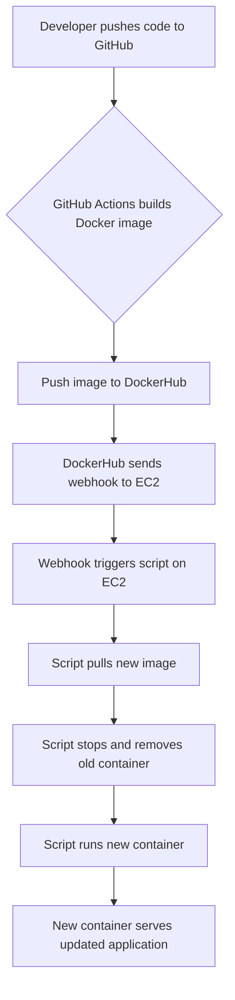

# Project 5 - CD

## Project Overview

### Goal of this Project

The goal of this project is to automate the deployment of an Angular application running in a Docker container on an EC2 instance. When a developer pushes new code to the GitHub repository, it triggers a series of automated steps that build a new Docker image, push it to DockerHub, and update the running container on the EC2 instance via a webhook. This makes sure the application is always up-to-date with the latest changes.

### Tools Utilized

- GitHub: Hosts the repository and triggers the CI/CD pipeline.
- GitHub Actions: Automates the build and push of the Docker image to DockerHub.
- Docker: Containerizes the Angular application for consistent deployment.
- DockerHub: Stores and distributes the Docker image.
- EC2: Runs the containerized application.
- adnanh/webhook: Listens for payloads from DockerHub to trigger deployment updates.
- Nginx: Serves the Angular application inside the container.

### Diagram of Project



## Part 1 - Semantic Versioning

### Generating Tags

#### Checking Tags in a git Repository

To see tags in a git repository run the following command:

```bash
git tag
```

This command will list all tags present locally.

To view tags in the remote repository use:

```bash
git ls-remote --tags origin
```

#### Generating Tags in a git Repository

To generate a basic tag without metadata use:

```bash
git tag v1.0.0
```

To generate a tag with an annotation (metadata) use:

```bash
git tag v1.0.0 -m "Initial release"
```

Replace the `v1.0.0` with a desired tag/verision number.

Replace `Initial release" with a desired annotation.

#### Pushing a tag to GitHub

To push a tag(s) use the following commands:

To push a specific tag to GitHub use:

```bash
git push origin v1.0.0
```

To push all local tags to GitHub use:

```bash
git push origin --tags
```

### Semantic Versioning Container Images with GitHub Actions

This project

#### Summary of Workflow

- The workflow gets triggered whenever a tag matching the semantic versioning format is pushed.
- Builds Docker image from the Dockerfile
- Generates three tags for the image:
  - latest
  - Major version
  - Major.minor verision
- Pushes the image to DockerHub with those tags.

#### Explanation of Workflow Steps

Below is the workflow file being used:

```yml
name: CI

on:
  push:
    tags:
      - 'v*.*.*'

jobs:
  build:
    runs-on: ubuntu-latest
    steps:
      - name: Checkout code
        uses: actions/checkout@v3

      - name: Generate Docker metadata
        id: meta
        uses: docker/metadata-action@v5
        with:
          images: ${{ secrets.DOCKER_USERNAME }}/bhavsar-ceg3120
          tags: |
            type=semver,pattern={{version}}
            type=semver,pattern={{major}}
            type=semver,pattern={{major}}.{{minor}}
            type=raw,value=latest

      - name: Login to DockerHub
        uses: docker/login-action@v3
        with:
          username: ${{ secrets.DOCKER_USERNAME }}
          password: ${{ secrets.DOCKER_TOKEN }}

      - name: Build and push Docker image
        uses: docker/build-push-action@v5
        with:
          context: .
          push: true
          tags: ${{ steps.meta.outputs.tags }}

```

1. Checkout Code: `actions/checkout@v3` to grab the repository code.
2. Generate Metadata: `docker/metadata-action@v5` is used to create tags based on the git tag.
3. Login to DockerHub: `docker/login-action@v3` is used along with the secrets to authenticate to DockerHub.
4. Build and Push Image: `ocker/build-push-action@v5` is used to build the image and push it to DockerHub with the aforementioned tags.

#### Changes in Workflow

I updated my existing workflow yaml file to accommodate the workflow with tags.

The most noteable changes are the on push tags and generating docker metadata portions of the file.

#### Link to Workflow

[CI.yml](https://github.com/WSU-kduncan/ceg3120-cicd-OmB9/blob/main/.github/workflows/ci.yml)

### Testing & Validating

#### Test Workflow is Working

To test the workflow works as intended follow these steps:

1. Create and push a new tag:

    ```bash
    git tag -a v1.0.1 -m "Test release"
    git push origin v1.0.1
    ```

2. Navigate to the "Actions" tab in your GitHub repository.
3. Verify workflow ran successfully.

#### Verify Image Runs

1. Pull the image from DockerHub:

    ```bash
    docker pull [DockerUsername]/[RepoName]:1.0
    ```

- Make sure to replace `[DockerUsername]` with your username and `[RepoName]` with your repo name.

2. Run a container:

    ```bash
    docker run -p 8080:80 [DockerUsername]/[RepoName]:1.0
    ```

- Make sure to replace `[DockerUsername]` with your username and `[RepoName]` with your repo name.

3. Open a browser and go to `http://localhost:8080` to verify the application runs as expected.

## Part 2 - Continuous Deployment

### EC2 Instance Details

Below are the details of the EC2 instance I used:

- AMI: `ami-084568db4383264d4`
  - OS: Ubuntu Linux 24.04
- Instance Type: `t2.medium`
  - CPU: 2 vCPUs
  - RAM: 4 GB
  - Storage: 30 GB (Rccomonded volume size)
- Security Group Configuration
  - Port 22 (SSH): Allow inbound traffic from only my home IP and WSU's CIDR.
  - Port 80 (HTTP): Allow inbound traffic from all.
  - Port 9000 (Webhook): Allow inbound traffic from all
- Security Group Configuration Justification
  - Port 22 (SSH): Enables secure remote management, IPs have been restricted for security.
  - Port 80 (HTTP): Exposes the application to the internet.
  - Port 9000 (Webhook): Listens for the webhook payload to then trigger deployments.

### Docker Setup on EC2 Instance

1. Update existing packages:

    ```bash
    sudo apt update
    ```

2. Install a few prerequisite packages:

    ```bash
    sudo apt install apt-transport-https ca-certificates curl software-properties-common
    ```

3. Add the GPG key for the official Docker repository:

    ```bash
    curl -fsSL https://download.docker.com/linux/ubuntu/gpg | sudo gpg --dearmor -o /usr/share/keyrings/docker-archive-keyring.gpg
    ```

4. Add the Docker repository to APT sources:

    ```bash
    echo "deb [arch=$(dpkg --print-architecture) signed-by=/usr/share/keyrings/docker-archive-keyring.gpg] https://download.docker.com/linux/ubuntu $(lsb_release -cs) stable" | sudo tee /etc/apt/sources.list.d/docker.list > /dev/null
    ```

5. Update existing packages again:

    ```bash
    sudo apt update
    ```

6. Make sure you are about to install from the Docker repo instead of the default Ubuntu repo

    ```bash
    apt-cache policy docker-ce
    ```

7. Install Docker:

    ```bash
    sudo apt install docker-ce
    ```

8. Check that Docker is running:

    ```bash
    sudo systemctl status docker
    ```

9. Add your user to docker group:

    ```bash
    sudo usermod -aG docker ${USER}
    ```

    - To have the above mentioned command apply the new group membership, log out of the server and back in.

10. Verify Docker installation with:

    ```bash
    docker --version
    ```

### Testing EC2 Instance

- Pull image from DockerHub:

    ```bash
    docker pull [DockerUsername]/[LastName]-ceg3120:latest
    ```

- Run container interactively:

    ```bash
    docker run -it -p 80:80 [DockerUsername]/[LastName]-ceg3120:latest
    ```

  - `-it` Runs interactively with a terminal, easier for debugging.

- Run container in background:

    ```bash
    docker run -d -p 80:80 [DockerUsername]/[LastName]-ceg3120:latest
    ```

  - `-d` Runs detached in the background.

#### Verifying Container Serves the Application

- Container Side:
  - Access the container:
  
    ```bash
    docker exec -it [conatinerID] sh
    ```
  
  - Verify app files:
  
    ```bash
    ls /usr/share/nginx/html
    ```

  - Test server:

    ```bash
    curl http://localhost
    ```

- Host Side:
  - On the EC2 Instance:
  
    ```bash
    curl http://localhost
    ```

- From External Connection
  - Navigate to the EC2 instance's public IP from a web browser.

#### Steps to Manually Refresh the Container Application if a New Image is Available on DockerHub

1. Pull the latest image:

    ```bash
    docker pull [DockerUsername]/[LastName]-ceg3120:latest
    ```

2. Stop and remove the existing container:

    ```bash
    docker stop <container-id>
    docker rm <container-id>
    ```

3. Start a new container:

    ```bash
    docker run -d -p 80:80 [DockerUsername]/[LastName]-ceg3120:latest
    ```

### Scripting Container Application Refresh

#### Creating a Bash Script to Automate Deployments

Create a script at: `/home/ubuntu/deployment/script.sh`:

```bash
#!/bin/bash

LOG_FILE="/home/ubuntu/deployment/deploy.log"
IMAGE_NAME="[DockerUsername]/[LastName]-ceg3120"
TAG="latest"

echo "$(date) - Starting deployment" >> $LOG_FILE

# Stop and remove existing containers
docker stop $(docker ps -q --filter ancestor=${IMAGE_NAME}:${TAG}) >> $LOG_FILE 2>&1
docker rm $(docker ps -a -q --filter ancestor=${IMAGE_NAME}:${TAG} --filter status=exited) >> $LOG_FILE 2>&1

# Pull the latest image
docker pull ${IMAGE_NAME}:${TAG} >> $LOG_FILE 2>&1

# Run a new container
docker run -d -p 80:80 ${IMAGE_NAME}:${TAG} >> $LOG_FILE 2>&1

echo "$(date) - Deployment finished" >> $LOG_FILE
```

#### Testing the Script

1. Make the script executable:

    ```bash
    chmod +x /home/ubuntu/deployment/script.sh
    ```

2. Execute the Script:

    ```bash
    /home/ubuntu/deployment/script.sh
    ```

3. Verify the container is running:

    ```bash
    docker ps
    ```

4. Check the app is running:

- Navigate to the EC2 instance's public IP from a web browser

#### Link to Bash Script

- [script.sh](https://github.com/WSU-kduncan/ceg3120-cicd-OmB9/blob/main/deployment/script.sh)

### Configuring a Webhook Listener on EC2 Instance

#### Installing Adnanh's Webhook

Install the webhook by running the following commands:

```bash
wget https://github.com/adnanh/webhook/releases/download/2.8.2/webhook-linux-amd64.tar.gz
tar -xvf webhook-linux-amd64.tar.gz
sudo mv webhook-linux-amd64/webhook /usr/local/bin/
```

#### Verifying Installation

Check webhook version by running:

```bash
webhook --version
```

#### Summary of Webhook Definition File

The `hooks.json` file defines the webhook behavior. Triggers the `script.sh` when a payload with the matching secret is received.

#### Verifying Definition File Was Loaded

Run webhook with:

```bash
webhook -hooks /home/ubuntu/deployment/hooks.json -verbose -port 9000
```

Confirm "Loaded hooks from file" appears in the output.

#### Verfiying Webhook Can Recieve Payloads

Montior logs by running:

```bash
tail -f /var/log/webhook.log
```

Look for "Incoming HTTP request" entries

#### What to Look for in Docker Process Views

Use `docker ps` to confirm the container restarts after a webhook trigger.

#### Link to Definition File

- [hooks.json](https://github.com/WSU-kduncan/ceg3120-cicd-OmB9/blob/main/deployment/hook.json)

### Configuring a Payload Sender

#### Justification for Selecting DockerHub

I chose DockerHub since it integrates image pushes with deployment triggers, ensuring the latest image is always deployed.

#### How to Enable DockerHub to Send Payloads

1. In DockerHub, navigate to your repository > "Webhooks."
2. Add a webhook URL: http://[ec2-public-ip]:9000/hooks/deploy?secret=[secret].

#### Triggers

A new image will push repo triggers to webhook.

#### Verifying Successful Payload Delivery

Check webhook logs for "200 OK" responses after a push:

```bash
tail -f /var/log/webhook.log
```

### Configuring a Webhook Service on EC2 Instance

#### Summary of Webhook Service File Contents

The webhook.service file configures the webhook listener as a systemd service for automatic startup and management.

#### Enabling and Starting Webhook Service

1. Place the service file in /etc/systemd/system/webhook.service
2. Enable and start it by running:

    ```bash
    sudo systemctl enable webhook
    sudo systemctl start webhook
    ```

#### Verifying the Service Captures Payloads

Check the service status:

```bash
sudo systemctl status webhook
```

Review logs for payload receipt and script execution.

#### Link to service file

- [webhook.service](https://github.com/WSU-kduncan/ceg3120-cicd-OmB9/blob/main/deployment/webhook.service)

## Refrences

- [GitHub Tags Tutorial](https://www.youtube.com/watch?v=govmXpDGLpo)
- [Docker Tagging KB](https://docs.docker.com/build/ci/github-actions/manage-tags-labels/)
- [Git-Based Semantic Versioning](https://github.com/marketplace/actions/git-semantic-version)
- [Installing Docker on Ubuntu 22.04](https://www.digitalocean.com/community/tutorials/how-to-install-and-use-docker-on-ubuntu-22-04)
- AI prompt: Best practices to create a bash script that will stop and remove the formerly running container, pull the latest tagged image from a DockerHub repository, & run a new container process with the pull'ed image.
- [adnanh's webhook](https://github.com/adnanh/webhook)
- AI prompt: Best practices to setup adnanah's webhook
- AI prompt: Make a configuration file that is a webhook definition. The hook definition should: Trigger your bash script to run when a payload is received & validate that the payload came from a trusted source via a shared secret or by validating payload is from DockerHub or GitHub.
- AI prompt: Best practices for setting up adnanh's webhook as a service.
- [Docker Webhooks](https://docs.docker.com/docker-hub/repos/manage/webhooks/)
- [Mermaid in Markdown](https://www.youtube.com/watch?v=qGsQolMh9zE)
- [Mermaid getting started](https://mermaid.js.org/intro/getting-started.html)
- [Mermaid VS Code extension](https://marketplace.visualstudio.com/items/?itemName=bierner.markdown-mermaid)
